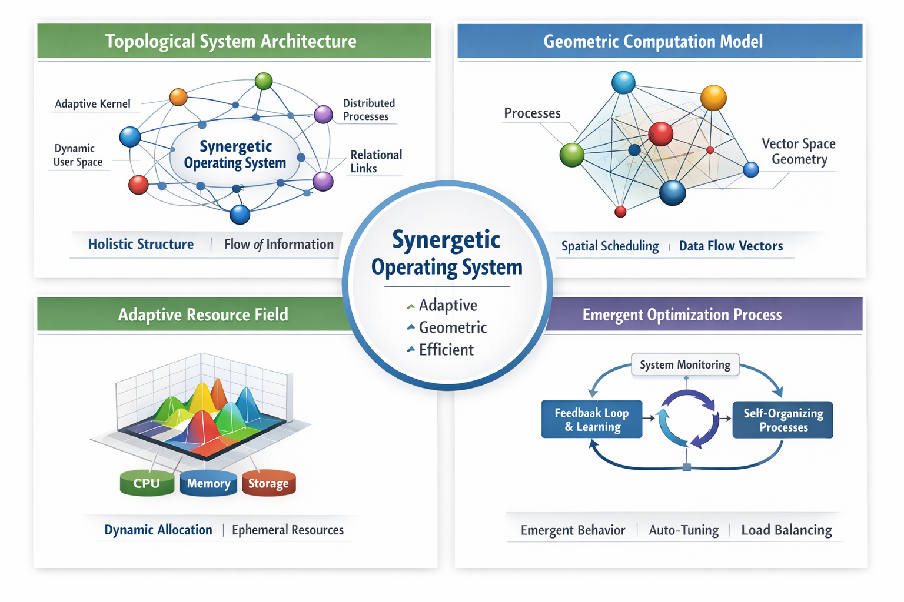

# 🧠 Synergetic Operating System (SOS)


# Project Website:
(https://solomonyaw.github.io/Synergetic-Operating-System/)

### A Topology-Based, Emergent Operating System Architecture

---

## 📌 Origin of the Project

The **Synergetic Operating System (SOS)** is the original intellectual conception of:

# **Solomon Yaw Adeklo**


- GitHub: https://github.com/solomonyaw  
- Project Repository: https://github.com/solomonyaw/Synergetics-Operating-System  
- Email: sadeklo@st.vvu.edu.gh
- documentation: https://github.com/solomonyaw/Synergetics-Operating-System/blob/master/A%20comprehensive%20systems%20documentation%20of%20Synergetics%20operating%20system.pdf
- Whitepaper: https://github.com/solomonyaw/Synergetics-Operating-System/blob/master/SYNERGETIC%20OPERATING%20SYSTEM%20-%20White%20Paper.pdf

This project was conceived as a new computing paradigm inspired by:
- Synergetics and systems theory  
- Graph-based computation  
- Emergent behavior systems  
- Topological resource modeling  

The originator has experience in **application-level programming** and developed this system conceptually using:
- systems design thinking  
- simulation modeling  
- generative AI-assisted development tools like ChatGPT

  ## 🌌 Design Model For The Synergetics Operating System
  

---

## 🌌 Vision

Traditional operating systems rely on:
- Hierarchical process trees  
- Static resource allocation  
- Time-sliced scheduling  

### Synergetic OS proposes:

- Graph-based computation instead of process hierarchy  
- Dynamic resource fields instead of static allocation  
- Emergent scheduling instead of fixed priority queues  
- Self-organizing system topology  

---

## 🧩 Core Principles

- 🧠 Topological computation model  
- ⚡ Resource field abstraction  
- 🔄 Emergent scheduling behavior  
- 🌱 Ephemeral process lifecycle  
- 🔗 Relational system intelligence  

---

## 🏗 System Architecture




### Core Components:

- Adaptive Topology Scheduler  
- Resource Field Engine  
- Emergence Controller  
- Graph-Based Process Model  
- Feedback Optimization Loop  

---

## ⚙️ Technology Stack

### Primary Language
- 🦀 Rust — systems programming + kernel development

### Supporting Technologies
- Python — simulation & prototyping  
- Linux Kernel — integration base  
- eBPF — advanced scheduling experiments  

---

## 🚀 Development Phases

### Phase 1: Simulation Layer (Current)
- Rust-based graph scheduler simulation  
- Emergent behavior modeling  
- Visualization of system optimization  

### Phase 2: Linux Integration
- Hook into Linux scheduler  
- Map processes into topology graph  
- Test adaptive scheduling behavior  

### Phase 3: Rust Kernel Prototype
- Bare-metal kernel development  
- Custom scheduler implementation  
- Resource field engine  

### Phase 4: Full Synergetic OS
- Independent operating system  
- Fully emergent computation model  

---

## 🧪 Example Simulation Output

```text
Step 1: Best Score = 12.42  
Step 2: Best Score = 13.87  
Step 3: Best Score = 15.21  
Step 4: Best Score = 16.03  
